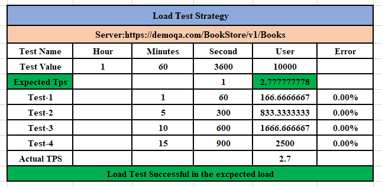
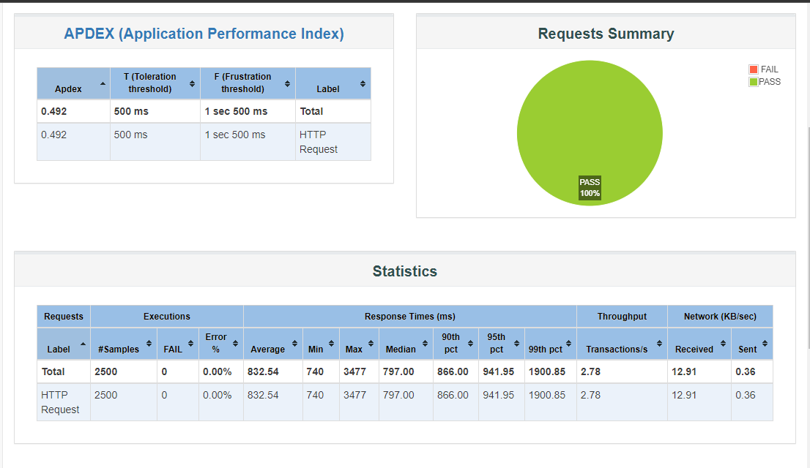

# book_api-load-testing-by-jmeter

### **Mission**

- #### To get the actual TPS(Transection Per Second), when 10000 users visit the website within 1 hour.
- #### [API](https://demoqa.com/BookStore/v1/Books)

### **Output**

- [**Excel and Pdf Report**](https://github.com/iamhasib121/book_api-load-testing-by-jmeter/blob/main/ActualTps.png)

  
  
